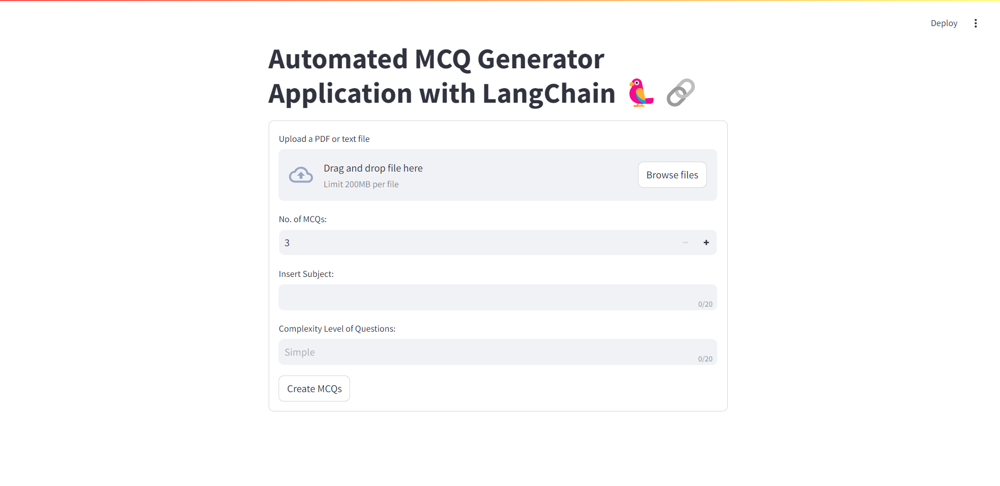
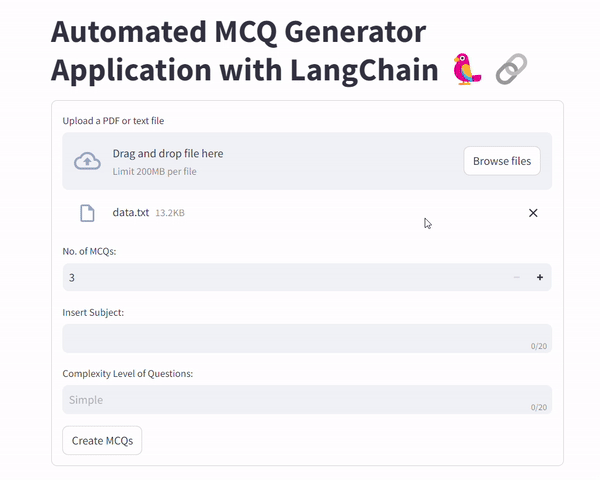
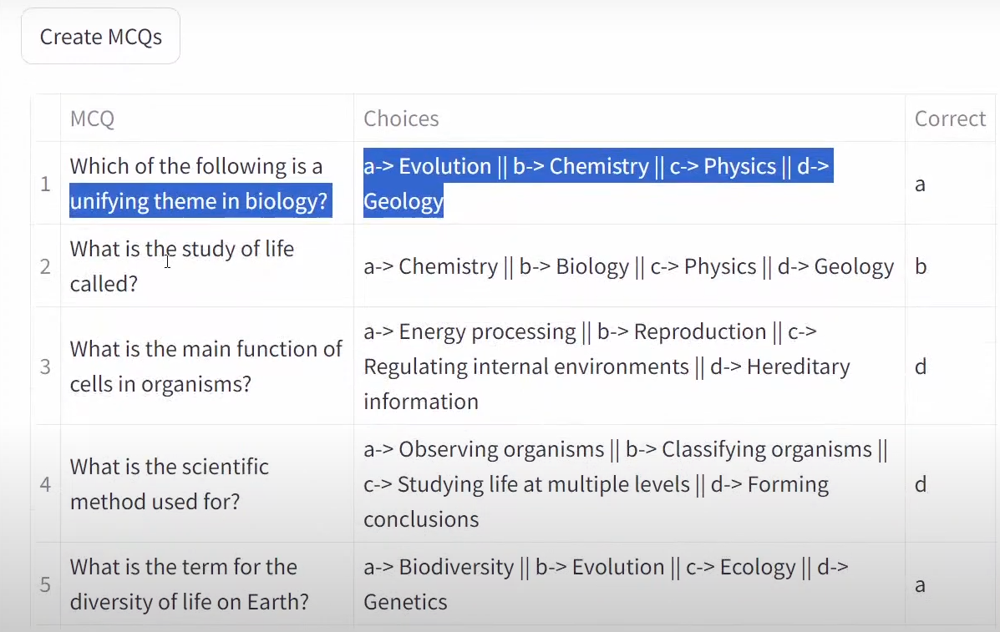
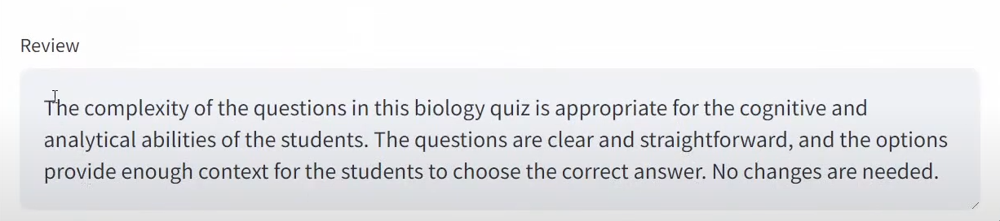
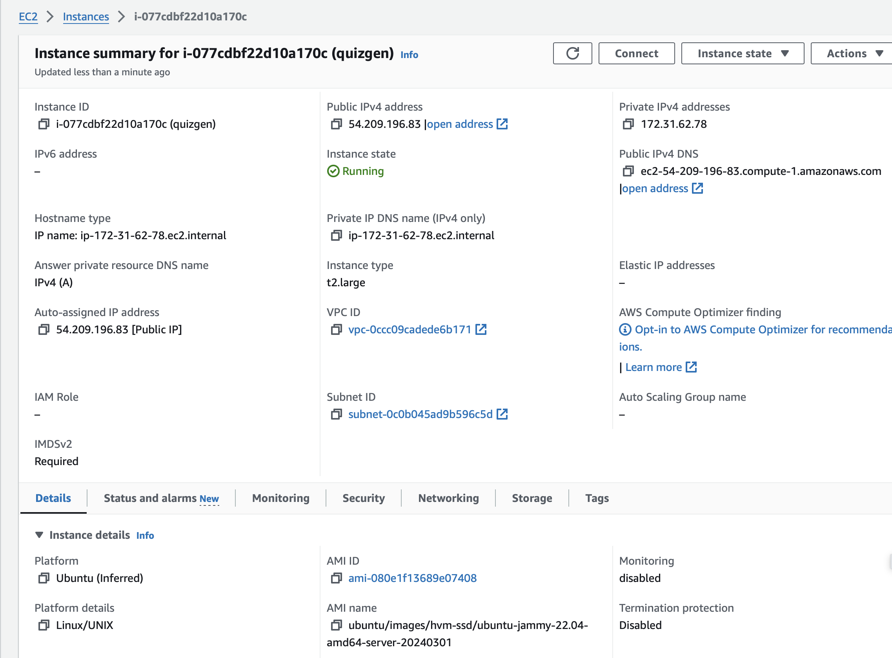

# 🎓 MCQ Generator using Generative AI

This project utilizes the OpenAI API and LangChain to create a Generative AI model that generates multiple-choice questions (MCQs) based on given input files. The model accepts `.txt` and `.pdf` files and allows users to specify the subject and tone (difficulty level) to generate the desired number of MCQs. An engaging web interface is built using Streamlit for easy interaction.

---

<!-- ABOUT THE PROJECT -->
## About The Project

In this project, we have leveraged the capabilities of OpenAI models and Langchain API to generate quiz questions of MCQ or True/False type from a given text/PDF. The project aims to automate the process of generating quiz questions, thereby saving time and effort for educators, content creators, and learners. By utilizing advanced natural language processing (NLP) models, the application can extract key information from the text and formulate relevant quiz questions based on the content.

The user can decide the number of questions to be generated, and the complexity level of the questions. The application provides a user-friendly interface that allows users to input the text or upload a PDF document, select the desired parameters, and generate quiz questions with a single click. The generated questions can be used for educational purposes, training materials, assessments, or content creation across various domains.

---

## 📸 Screenshots

### 🏠 Main Dashboard  
An intuitive homepage to start uploading and customizing your MCQ generation.


### 📤 Input Form  
Upload `.txt` or `.pdf` files, set subject, number of questions, and difficulty level.


### 📋 Output Preview  
Generated MCQs displayed in a clean, interactive table for easy review.


### 🧠 Expert Review  
Review the complexity of questions and refine them as needed.



---

## ✨ Features

- 📂 **File Upload**: Accepts `.txt` and `.pdf` files for MCQ generation.  
- 🎛️ **Customization**: Choose the number of questions, subject, and difficulty (tone).  
- 🤖 **AI-Powered**: Uses OpenAI’s GPT models via LangChain for intelligent question creation.  
- 📊 **Instant Review**: View MCQs in a table and get an expert review of question complexity.  
- 📝 **Logging**: All activity is logged for transparency and debugging.  
- 🖥️ **Streamlit UI**: Clean, interactive web interface for all users.

---

## 🗂️ Project Structure

```
├── [StreamlitAPP.py](http://_vscodecontentref_/2)         # Main Streamlit web app
├── src/
│   └── mcqgenerator/
│       ├── [MCQGenerator.py](http://_vscodecontentref_/3) # Core MCQ generation logic
│       ├── [utils.py](http://_vscodecontentref_/4)        # File reading and data utilities
│       ├── [logger.py](http://_vscodecontentref_/5)       # Logging setup
├── [test.py](http://_vscodecontentref_/6)                 # CLI test script
├── [requirements.txt](http://_vscodecontentref_/7)        # Python dependencies
├── [setup.py](http://_vscodecontentref_/8)                # Package setup
├── [data.txt](http://_vscodecontentref_/9)                # Sample input data
├── [Response.json](http://_vscodecontentref_/10)           # Sample MCQ response format
├── logs/                   # Log files
├── experiment/             # Notebooks and experiments
└── [mcqgenrator.egg-info](http://_vscodecontentref_/11)   # Package metadata
```

---

## 🛠️ Tech Stack

- Python 3.9+
- OpenAI API
- LangChain
- Streamlit
- PyPDF2
- python-dotenv
- pandas

---

## 🌟 Example Workflow

1. Upload a `.txt` or `.pdf` file via the web interface.
2. Set the number of MCQs, subject, and question complexity.
3. Click **Generate** — the app uses OpenAI + LangChain to create MCQs.
4. Review the generated questions and download them for your use!

---


<!-- DEPLOYMENT -->
## Deployment
The application is deployed via AWS EC2 instance. That can be achieved by following the steps below:

1. **Create an AWS EC2 Instance**: 
    - Launch an EC2 instance with the desired configuration.
    - Ensure that the security group associated with the instance allows inbound traffic on port 8501 (Streamlit default port).

2. **SSH into the EC2 Instance**:
    - Use the SSH key pair associated with the EC2 instance to connect to the instance.

3. **Install Required Packages**:
    - Install the necessary packages and dependencies on the EC2 instance.
    - Ensure that Python, Streamlit, and other required libraries are installed.
    - It can be done using the following commands:
    <br>
    <sh>

    ```
    sudo apt-get update
    ```

    ```
    sudo apt upgrade -y
    ```

    ```
    sudo apt install python3-pip git curl unzip tar make sudo vim get -y
    ```

    ``` 
    git clone "Your-repository"
    ```

    ```
    cd "Your-repository"
    ```

    ```
    pip3 install -r requirements.txt
    ```
    </sh>


4. **Initialize the OPENAI API Key**:
    - Set up the OpenAI API key on the EC2 instance.
    - Create a `.env` file in the project directory and add the OpenAI API key.
    - The `.env` file should contain the following line:
    <br>
    <sh>

    ```
    OPENAI_API_KEY=your_openai_api_key
    ```
    </sh>

5. **Run the Streamlit Application**:
    - Run the Streamlit application on the EC2 instance.
    - Use the following command to start the Streamlit server:
    <br>
    <sh>

    ```
    python3 -m streamlit run StreamlitAPP.py
    ```
    </sh>


6. **Access the Application**:
    - Access the Streamlit application by visiting the public IP address of the EC2 instance followed by port 8501.
    - The application should be accessible via a web browser.
    - The URL format is as follows:

    <sh>
    
    ```
    http://"Your-EC2-Public-IP":8501
    ```
    </sh>

The application should now be up and running on the AWS EC2 instance, allowing users to generate quiz questions from text or PDF documents. The screenshots for the instance are shown below:



---


## 🚀 Setup and Run

1. **Clone the repository**:
   ```bash
   git clone https://github.com/Aashay30/MCQ_Generator
   cd mcq-generator

2. **Create a virtual environment**:
   ```bash
   conda create --name env python=3.9

3. **Activate the environment**:
   ```bash
   conda activate env

4. **Install the required dependencies**:
   ```bash
   pip install -r requirements.txt

5. **Set up your OpenAI API key**:
    Make sure to set your OpenAI API key in your environment variables. You can do this by adding the following line to your .bashrc or .bash_profile:

   ```bash
   export OPENAI_API_KEY='your_openai_api_key'
    ```

   Replace 'your_openai_api_key' with your actual OpenAI API key

6. **Run the Streamlit app**:
   ```bash
   streamlit run app.py

The web interface should open in your browser automatically. If it doesn't, the local URL will be output in the terminal; just copy it and open it manually. By default, it will be http://localhost:8501/.

---

## 📄 Data Input

The model accepts input files in the following formats:

- **Text files (`.txt`)**
- **PDF files (`.pdf`)**

You can upload these files through the web interface and specify the subject and tone to generate MCQs.

## 🎉 Features

- Generate MCQs based on provided input files.
- Specify the subject and tone (difficulty level) for tailored question generation.
- User-friendly interface built with Streamlit for easy interaction.

## 🌐 Web Interface

The web interface allows users to upload files, specify the subject, and set the difficulty level. Once the input is provided, the model generates the desired number of MCQs, which can be viewed and downloaded.

Feel free to explore the project and enhance the MCQ generation experience! 📚✨
